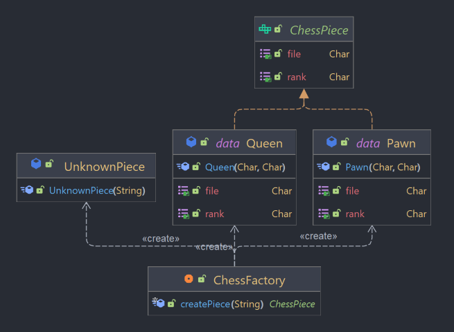
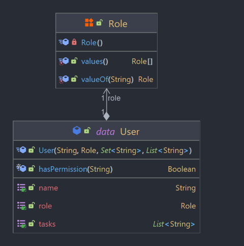
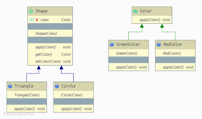

# Kotlin Design Patterns


## What is Design Patterns ?

Design Patterns are a proven way to solve common programming problems.
These issues or questions will usually arise during the software development period for programmers.
Pattern design solutions are typically using object-oriented.

## Advantage of design pattern

1. They are reusable in multiple projects.
2. They provide the solutions that help to define the system architecture.
3. They capture the software engineering experiences.
4. They provide transparency to the design of an application.
5. They are well-proved and testified solutions since they have been built upon the knowledge and experience of expert
   software developers.

## Type of design pattern

### [Creational Design Pattern](https://github.com/ghasemdev/kotlin-design-patterns#creational-design-pattern-1)

1. [Singleton Pattern](#singleton-pattern)
2. [Factory Pattern](#factory-pattern)
3. [Abstract Factory Pattern](#abstract-factory-pattern)
4. [Builder Pattern](#builder-pattern)
5. [Prototype Pattern](#prototype-pattern)

### [Structural Design Pattern](https://github.com/ghasemdev/kotlin-design-patterns#structural-design-pattern-1)

1. [Decorator Pattern](#decorator-pattern)
2. [Adapter Pattern](#adapter-pattern)
3. [Bridge Pattern](#bridge-pattern)
4. [Composite Pattern](#composite-pattern)
5. [Facade Pattern](#facade-pattern)
6. [Flyweight Pattern](#flyweight-pattern)
7. [Proxy Pattern](#proxy-pattern)

### [Behavioral Design Pattern](https://github.com/ghasemdev/kotlin-design-patterns#behavioral-design-pattern-1)

1. [Chain Of Responsibility Pattern](#chain-of-responsibility-pattern)
2. [Command Pattern](#command-pattern)
3. [Interpreter Pattern](#interpreter-pattern)
4. [Iterator Pattern](#iterator-pattern)
5. [Mediator Pattern](#mediator-pattern)
6. [Memento Pattern](#memento-pattern)
7. [Observer Pattern](#observer-pattern)
8. [State Pattern](#state-pattern)
9. [Strategy Pattern](#strategy-pattern)
10. [Template Pattern](#template-pattern)
11. [Visitor Pattern](#visitor-pattern)

# Creational Design Pattern

One of the sub-branches of Pattern Design is Creational Design Pattern. This pattern is a way to make things.
This template is used when we want to create an object from a class in our program.
But for many it may be very easy to build an object and just by new we create an object.
But hard code is not a good solution Because we sometimes change the identity of a class in our code, and in such cases
we have to use the Creational Design pattern.

## Singleton Pattern

[The singleton pattern](src/main/creational/singleton) ensures that only one object of a particular class is ever
created. All further references to object of the singleton class refer to the same underlying instance.


**Example**

```kotlin
object Logger {
    init {
        println("$this I was accessed for the first time")
    }

    fun log(massage: String) = println("$this massage = $massage")
}
```

**Usage**

```kotlin
Logger.log("Hello World")
Logger.log("Hello Kotlin")
```

**Output**

```
singleton.Logger@12f41634 I was accessed for the first time
singleton.Logger@12f41634 massage = Hello World
singleton.Logger@12f41634 massage = Hello Kotlin
```

## Factory Pattern

[The factory pattern](src/main/creational/factory) is used to replace class constructors,
abstracting the process of object generation so that the type of the object instantiated can be determined at run-time.
we can also use sealed class.



**Example**

```kotlin
interface ChessPiece {
    val file: Char
    val rank: Char
}

data class Pawn(
    override val file: Char,
    override val rank: Char
) : ChessPiece

data class Queen(
    override val file: Char,
    override val rank: Char
) : ChessPiece

class UnknownPiece(message: String) : RuntimeException(message)

object ChessFactory { // Factory create chess piece
    fun createPiece(notation: String): ChessPiece {
        val (type, file, rank) = notation.toCharArray()
        return when (type) {
            'p' -> Pawn(file, rank)
            'q' -> Queen(file, rank)
            else -> throw UnknownPiece(type.toString())
        }
    }
}
```

**Usage**

```kotlin
val notations = listOf("pa8", "qc3")
val pieces = mutableListOf<ChessPiece>()
for (n in notations) {
    pieces.add(ChessFactory.createPiece(n))
}
println(pieces)
```

**Output**

```
[Pawn(file=a, rank=8), Queen(file=c, rank=3)]
```

## Abstract Factory Pattern

[The abstract factory pattern](src/main/creational/abstractfactory) is used to provide a client with a set of related
or dependant objects. The "family" of objects created by the factory are determined at run-time.


**Example**

```kotlin
interface Property {
    val name: String
    val value: Any
}

data class IntProperty(
    override val name: String,
    override val value: Int
) : Property

data class StringProperty(
    override val name: String,
    override val value: String
) : Property

interface ServerConfiguration {
    val properties: List<Property>
}

data class ServerConfigurationImpl(
    override val properties: List<Property>
) : ServerConfiguration

typealias UnknownPropertyException = RuntimeException

abstract class Parser {
    abstract fun from(file: File): ServerConfiguration

    private fun property(prop: String): Property {
        val (name, value) = prop.split(":")

        return when (name) {
            "port" -> IntProperty(name, value.trim().toInt())
            "environment" -> StringProperty(name, value.trim())
            else -> throw UnknownPropertyException("Unknown property:$name")
        }
    }

    protected fun server(propertyStrings: List<String>): ServerConfiguration {
        val parsedProperties = mutableListOf<Property>()
        for (p in propertyStrings) {
            parsedProperties += property(p)
        }
        return ServerConfigurationImpl(parsedProperties)
    }
}

object YamlParser : Parser() {
    override fun from(file: File): ServerConfiguration {
        val propertyStrings = file.readLines().drop(1).map { it.trim() }
        return server(propertyStrings)
    }
}

object JsonParser : Parser() {
    override fun from(file: File): ServerConfiguration {
        val regex = """(\s|\{|}|"|,)*""".toRegex()
        val lines = file.readLines()
        val propertyStrings = lines.map { it.replace(regex, EMPTY) }.subList(2, lines.lastIndex - 1)
        return server(propertyStrings)
    }

    private const val EMPTY = ""
}
```

**Usage**

```yaml
server:
  port: 8080
  environment: production
```

```json
{
  "server": {
    "port": 8080,
    "environment": "production"
  }
}
```

```kotlin
val ymlPath = "configure.yml"
println(YamlParser.from(File(path)))

val jsonPath = "configure.json"
println(JsonParser.from(File(path)))
```

**Output**

```
ServerConfigurationImpl(properties=[IntProperty(name=port, value=8080), StringProperty(name=environment, value=production)])
ServerConfigurationImpl(properties=[IntProperty(name=port, value=8080), StringProperty(name=environment, value=production)])
```

## Builder Pattern

[The builder pattern](src/main/creational/builder) is used to create complex objects with constituent parts that must be
created in the same order or using a specific algorithm. An external class controls the construction algorithm.


**Example**

```kotlin
data class Mail(
    val to: List<String>,
    val cc: List<String>? = null,
    val title: String? = null,
    val message: String? = null,
    val important: Boolean = false
) {
    fun send() = println("Mail Sent")

    class Builder(initializer: Builder.() -> Unit = {}) {
        private var to: List<String> = listOf()
        private var cc: List<String>? = null
        private var title: String? = null
        private var message: String? = null
        private var important: Boolean = false

        init {
            initializer()
        }

        fun to(to: List<String>) = apply { this.to = to }
        fun cc(cc: List<String>) = apply { this.cc = cc }
        fun title(title: String) = apply { this.title = title }
        fun message(message: String) = apply { this.message = message }
        fun important(important: Boolean) = apply { this.important = important }

        fun build(): Mail {
            require(to.isNotEmpty()) { "To property is empty" }
            return Mail(to, cc, title, message, important)
        }
    }
}

fun mail(initializer: Mail.Builder.() -> Unit) = Mail.Builder(initializer).build()
```

**Usage**

```kotlin
val mail = Mail(to = listOf("mail@gmail.com"), title = "What's up?")
println(mail)
mail.send()

val mailFromBuilder = Mail.Builder()
    .to(listOf("mailFromBuilder@gmail.com"))
    .message("Hi")
    .build()
println(mailFromBuilder)

val mailFromDSLBuilder = Mail.Builder {
    to(listOf("mailFromDSLBuilder@gmail.com"))
    message("Hi")
}.build()
println(mailFromDSLBuilder)

val mailFromExt = mail {
    to(listOf("mailFromExt@gmail.com"))
    cc(listOf())
    title("???")
    message("Hi")
    important(true)
}
println(mailFromExt)
```

**Output**

```
Mail(to=[mail@gmail.com], cc=null, title=What's up?, message=null, important=false)
Mail Sent
Mail(to=[mailFromBuilder@gmail.com], cc=null, title=null, message=Hi, important=false)
Mail(to=[mailFromDSLBuilder@gmail.com], cc=null, title=null, message=Hi, important=false)
Mail(to=[mailFromExt@gmail.com], cc=[], title=???, message=Hi, important=true)
```

## Prototype Pattern

The purpose of a [pattern prototype](src/main/creational/prototype) is that we do not create different objects of the
same class, simplify an object we have, and do not pay to build a new object.
we can also implement Cloneable class or use `my_object.copy()` in Kotlin.



**Example**

```kotlin
enum class Role {
    ADMIN,
    SUPER_ADMIN,
    REGULAR_USER
}

data class User(
    val name: String,
    val role: Role,
    private val permissions: Set<String>,
    val tasks: List<String>,
) {
    fun hasPermission(permission: String) = permission in permissions
}
```

**Usage**

```kotlin
 // In real application this would be a database of users
private val allUser = mutableListOf(
    User(
        name = "Ali",
        role = Role.ADMIN,
        permissions = setOf("edit", "delete"),
        tasks = listOf("edit_users", "delete_users")
    )
)

fun createUser(name: String, role: Role) {
    for (user in allUser) {
        if (user.role == role) {
            allUser += user.copy(name = name)
            return
        }
    }
    // Handle case that no other user with such a role exists
}

createUser(name = "Reza", role = Role.ADMIN)
```

# Structural Design Pattern

Structural Patterns talk about objects and classes and how they combine.
This pattern creates a simple structure to indicate the relationship of objects and classes to each other.

## Decorator Pattern

[The decorator pattern](src/main/structural/decorator) is used to extend or alter the functionality
of objects at run-time by wrapping them in an object of a decorator class. This provides a flexible alternative to using
inheritance to modify behaviour.


**Example**

```kotlin
interface StarTrekRepository {
    operator fun get(starShipName: String): String
    operator fun set(starShipName: String, captainName: String)
}

class DefaultStarTrekRepository : StarTrekRepository {
    private val starShipCaptains = mutableMapOf("USS Enterprise" to "Jean-Luc Picard")

    override fun get(starShipName: String): String {
        return starShipCaptains[starShipName] ?: "Unknown"
    }

    override fun set(starShipName: String, captainName: String) {
        starShipCaptains[starShipName] = captainName
    }
}

class LoggingGetCaptain(private val repository: StarTrekRepository) : StarTrekRepository by repository {
    override fun get(starShipName: String): String {
        println("Getting captain for $starShipName")
        return repository[starShipName]
    }
}

class ValidatingAdd(private val repository: StarTrekRepository) : StarTrekRepository by repository {
    override fun set(starShipName: String, captainName: String) {
        require(captainName.length < MAX_NAME_LENGTH) {
            "$captainName is longer than $MAX_NAME_LENGTH characters!"
        }
        repository[starShipName] = captainName
    }

    companion object {
        private const val MAX_NAME_LENGTH = 15
    }
}

```

**Usage**

```kotlin
val starTrekRepository = DefaultStarTrekRepository()
val withValidating = ValidatingAdd(starTrekRepository)
val withLoggingAndValidating = LoggingGetCaptain(withValidating)

println(withLoggingAndValidating["USS Enterprise"])
withLoggingAndValidating["USS Voyager"] = "Kathryn Janeway"
```

**Output**

```
Jean-Luc Picard
java.lang.IllegalArgumentException: Kathryn Janeway is longer than 15 characters!
...
```

## Adapter Pattern

[The adapter pattern](src/main/structural/adapter) is used to provide a link between two otherwise incompatible types
by wrapping the "adapter" with a class that supports the interface required by the client.


**Example**

```kotlin
interface USPlug { val hasPower: Int }
interface EUPlug { val hasPower: String }
interface UsbMini { val hasPower: Power }
interface UsbTypeC { val hasPower: Boolean }

fun cellPhone(chargeCable: UsbTypeC): Boolean {
    return if (chargeCable.hasPower) {
        println("I've Got the Power!")
        true
    } else {
        println("No Power")
        false
    }
}

// Power outlet exposes USPlug interface
fun usPowerOutlet() = object : USPlug {
    override val hasPower: Int = 1
}

// Charger accepts EUPlug interface and exposes UsbMini interface
fun charger(plug: EUPlug) = object : UsbMini {
    override val hasPower: Power = Power.valueOf(plug.hasPower)
}

fun USPlug.toEUPlug(): EUPlug {
    val hasPower = if (hasPower == 1) "TRUE" else "FALSE"
    return object : EUPlug {
        override val hasPower: String = hasPower
    }
}

fun UsbMini.toUsbTypeC(): UsbTypeC {
    val hasPower = this.hasPower == Power.TRUE
    return object : UsbTypeC {
        override val hasPower: Boolean = hasPower
    }
}
```

**Usage**

```kotlin
cellPhone(charger(usPowerOutlet().toEUPlug()).toUsbTypeC())
```

**Output**

```
I've Got the Power!
```

## Bridge Pattern

When we need to make a distinction between abstraction and implementation, we
use [Bridge Pattern](src/main/structural/bridge). The reason for naming this pattern is that an interface is used as a
bridge, which separates between abstraction and implementation.



**Example**

```kotlin
interface Color {
    fun applyColor()
}

abstract class Shape(protected var color: Color /*implementor*/) {
    abstract fun applyColor()
}

class RedColor : Color {
    override fun applyColor() {
        println("red.")
    }
}

class GreenColor : Color {
    override fun applyColor() {
        println("green.")
    }
}

class Circle(color: Color) : Shape(color) {
    override fun applyColor() {
        print("Circle filled with color ")
        color.applyColor()
    }
}

class Triangle(color: Color) : Shape(color) {
    override fun applyColor() {
        print("Triangle filled with color ")
        color.applyColor()
    }
}
```

**Usage**

```kotlin
val redTriangle: Shape = Triangle(RedColor())
redTriangle.applyColor()

val greenTriangle: Shape = Triangle(GreenColor())
greenTriangle.applyColor()

val redCircle: Shape = Circle(RedColor())
redCircle.applyColor()

val greenCircle: Shape = Circle(GreenColor())
greenCircle.applyColor()
```

**Output**

```
Triangle filled with color red.
Triangle filled with color green.
Circle filled with color red.
Circle filled with color green.
```

## Composite Pattern

[The Composite pattern](src/main/structural/composite) helps us to have objects hierarchically,
or in other words, a tree structure.


**Example**

```kotlin
interface Employee {
    fun showEmployeeDetails()
}

class Developer(private var name: String, private var employeeId: Long, var position: String) : Employee {
    override fun showEmployeeDetails() {
        println("$employeeId $name")
    }
}

class Manager(private var name: String, private var employeeId: Long, var position: String) : Employee {
    override fun showEmployeeDetails() {
        println("$employeeId $name")
    }
}

class Company : Employee {
    private val employeeList: MutableList<Employee> = ArrayList()

    override fun showEmployeeDetails() {
        employeeList.forEach { it.showEmployeeDetails() }
    }

    fun addEmployee(employee: Employee) {
        employeeList.add(employee)
    }

    fun removeEmployee(employee: Employee) {
        employeeList.remove(employee)
    }
}
```

**Usage**

```kotlin
val engDirectory = Company()
val developer = Developer("jack", 100, "Developer")
engDirectory.addEmployee(developer)

val accDirectory = Company()
val manager = Manager("elias", 200, "Sr Manager")
accDirectory.addEmployee(manager)

val directory = Company()
directory.addEmployee(engDirectory)
directory.addEmployee(accDirectory)
directory.showEmployeeDetails()
```

**Output**

```
100 jack
200 elias
```

## Facade Pattern

## Flyweight Pattern

## Proxy Pattern

# Behavioral Design Pattern

## Chain Of Responsibility Pattern

## Command Pattern

## Interpreter Pattern

## Iterator Pattern

## Mediator Pattern

## Memento Pattern

## Observer Pattern

## State Pattern

## Strategy Pattern

## Template Pattern

## Visitor Pattern
